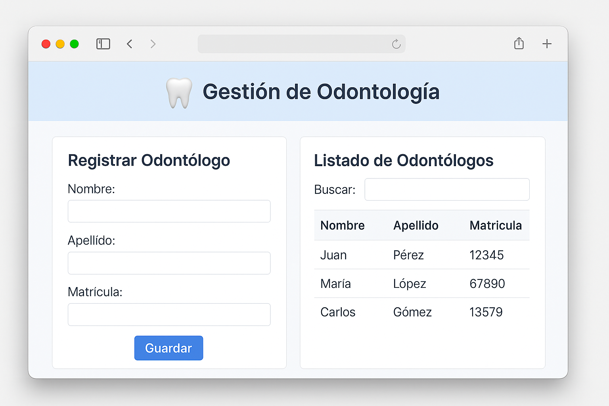

# 🦷 DH Odonto — App de Gestión de Dentistas



DH Odonto es una aplicación moderna desarrollada con **React** y **Vite**, pensada para gestionar información sobre dentistas de forma intuitiva. La app permite a los usuarios consultar detalles, agregar favoritos y personalizar la interfaz con temas claro y oscuro.

---

## 🚀 Tecnologías Utilizadas

- ⚛️ **React** — Librería para construir interfaces de usuario.
- ⚡ **Vite** — Empaquetador ultrarrápido para desarrollo frontend.
- 💅 **CSS Modules** o Styled Components — Estilos personalizados.
- 🌙 **Modo Dark/Light** — Alternancia entre temas.
- 📦 **Context API** — Para la gestión del estado global.
- 💖 **LocalStorage** — Persistencia de favoritos.

---

## 🧠 Características Principales

- 🔍 **Listado y búsqueda de dentistas**.
- 📋 **Detalle individual de cada dentista**.
- ⭐ **Agregar y eliminar favoritos**.
- 🌗 **Switch para cambiar entre modo claro y oscuro**.
- 📱 **Diseño responsivo**.

---

## 🔧 Instalación y Ejecución

```bash
git clone https://github.com/tu-usuario/dh-odonto.git
cd dh-odonto
npm install
npm run dev
